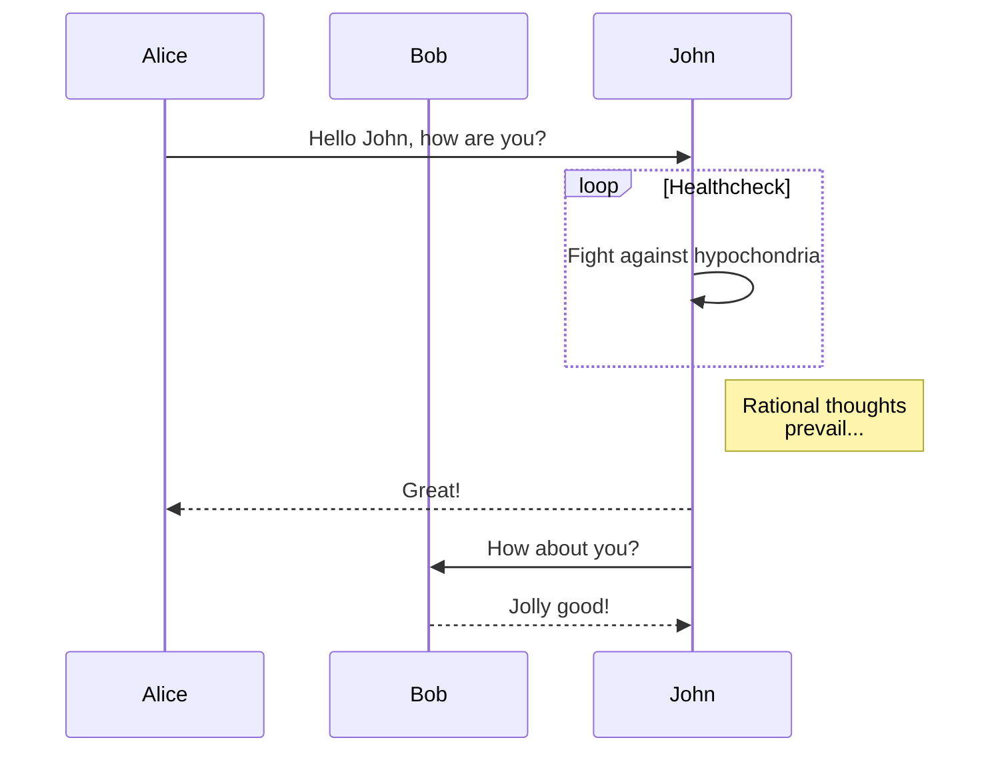
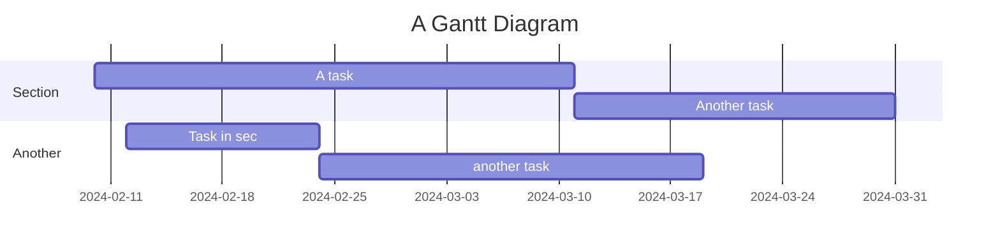
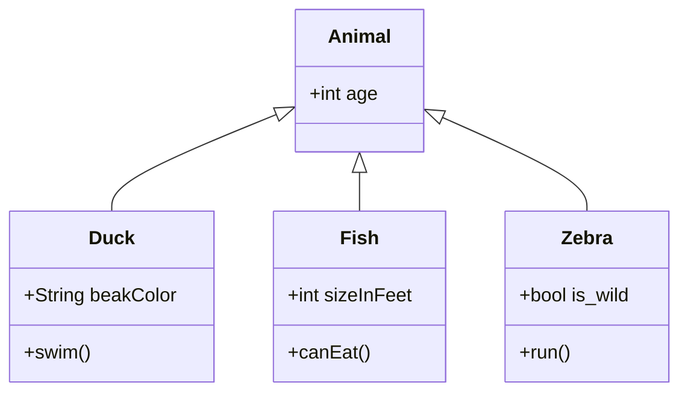
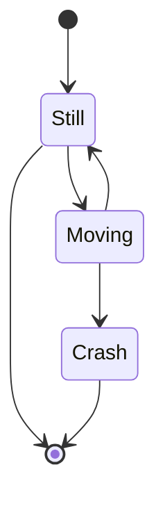
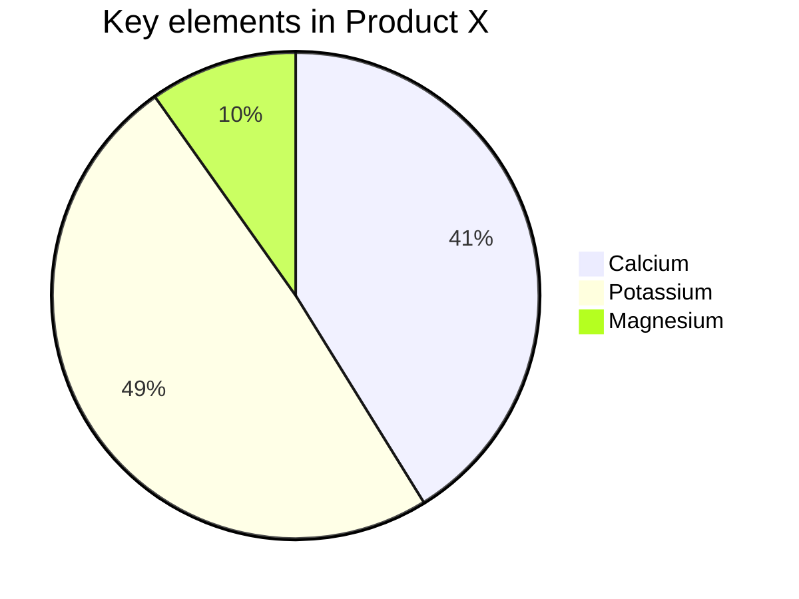
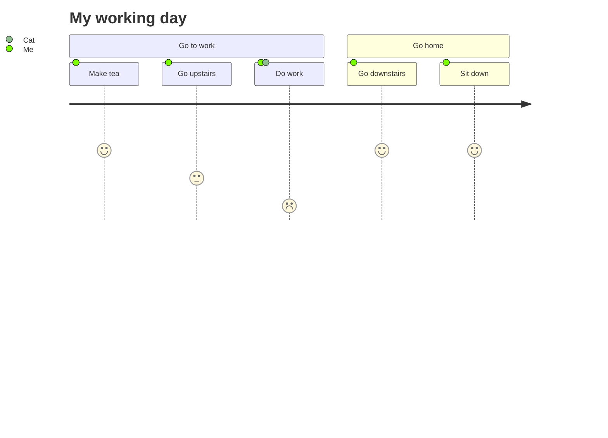

## Introducing MermaidJS Support: Create Stunning Diagrams in Bloggrify

Hello, readers! We are thrilled to announce another fantastic addition to Bloggrify: support for MermaidJS. With MermaidJS, you can now effortlessly create and embed beautiful diagrams and flowcharts directly in your Markdown posts. This powerful feature is perfect for visualizing complex information, making your content more engaging and easier to understand.

:toc{showChildren=true}

## What is MermaidJS?
MermaidJS is a JavaScript library that allows you to generate diagrams and flowcharts from text in a Markdown-like syntax. It supports a wide range of diagram types, including flowcharts, sequence diagrams, class diagrams, state diagrams, and more. MermaidJS is designed to be easy to use, yet powerful enough to handle complex visualizations.

You'll find more information on the [official website](https://mermaid-js.github.io/mermaid/).

## Why Use MermaidJS in Bloggrify?
Adding MermaidJS support to Bloggrify brings several advantages:

* Visualization: Enhance your content with clear and concise diagrams that help illustrate complex concepts.
* Ease of Use: Write simple text in MermaidJS syntax within your Markdown files to create sophisticated diagrams.
* Versatility: MermaidJS supports a variety of diagram types, making it suitable for many use cases, from technical documentation to process flows.

## Example Usage

### Flowchart

### Sequence Diagram

### Gantt Chart

### Class Diagram

### State Diagram

### Pie Chart

### User Journey

## Conclusion

With MermaidJS support, Bloggrify empowers you to create dynamic, informative, and visually appealing content. Whether you need to visualize workflows, represent complex systems, or simply add a touch of creativity to your posts, MermaidJS is the perfect tool.

We look forward to seeing the amazing diagrams you create with MermaidJS in your Bloggrify posts. Share your experiences and feedback with us, and stay tuned to Mistral for more exciting updates and tutorials!

Happy blogging!

