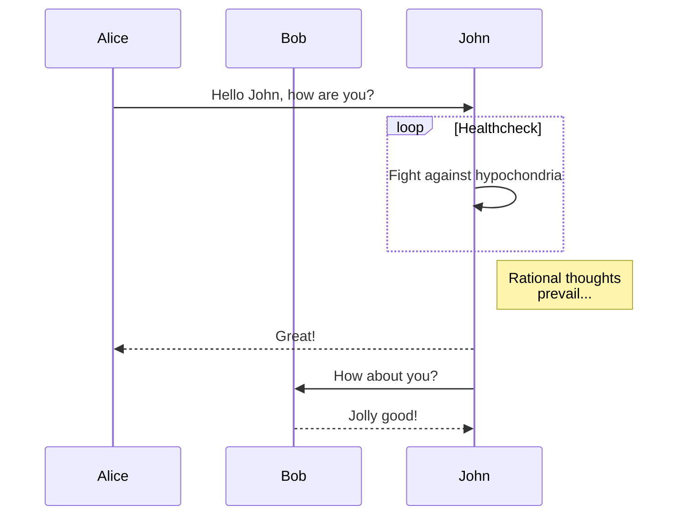
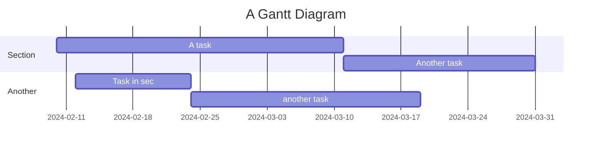
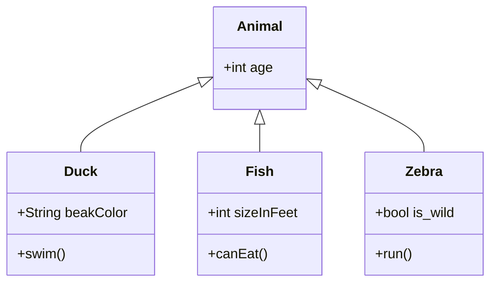
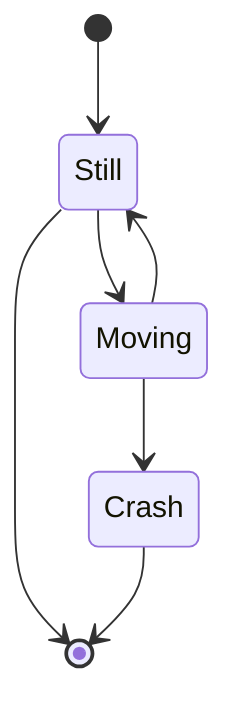
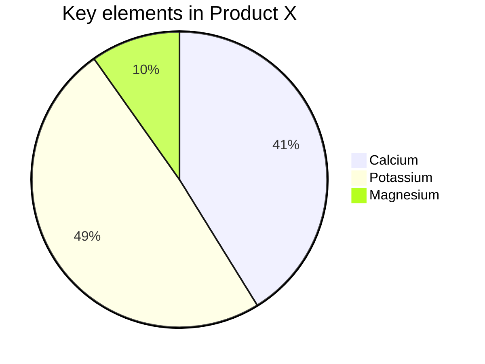
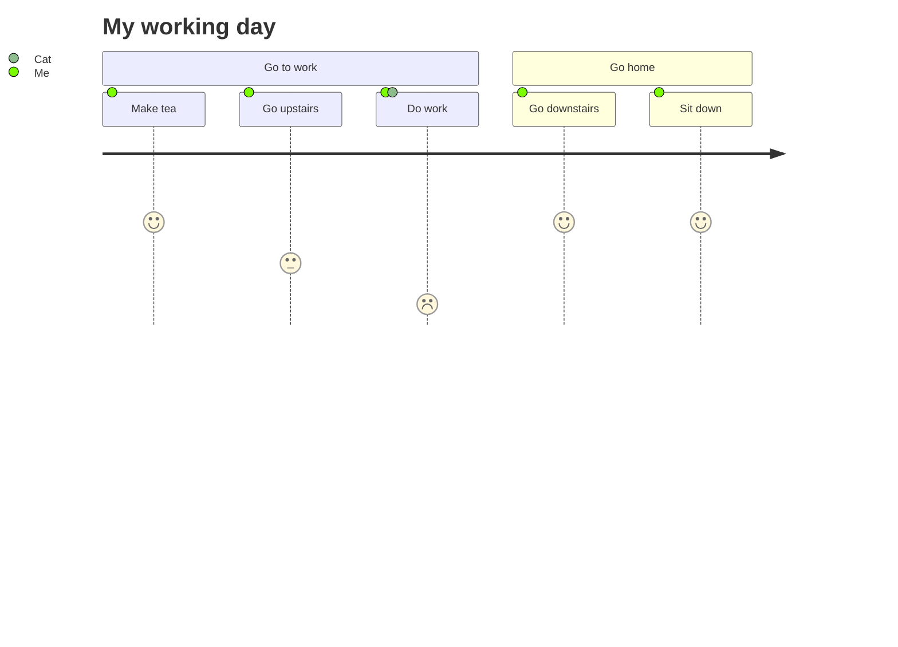

Mermaid is a diagramming and charting tool that uses Markdown-like text for fast and easy diagram creation.

You'll find more information on the [official website](https://mermaid-js.github.io/mermaid/).

:toc

## Flowchart

## Sequence Diagram

## Gantt Chart

## Class Diagram

## State Diagram

## Pie Chart

## User Journey

